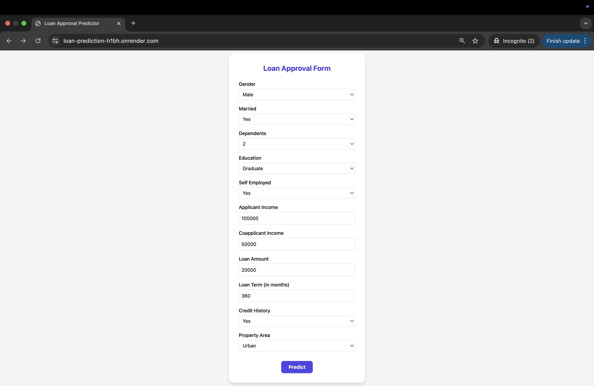
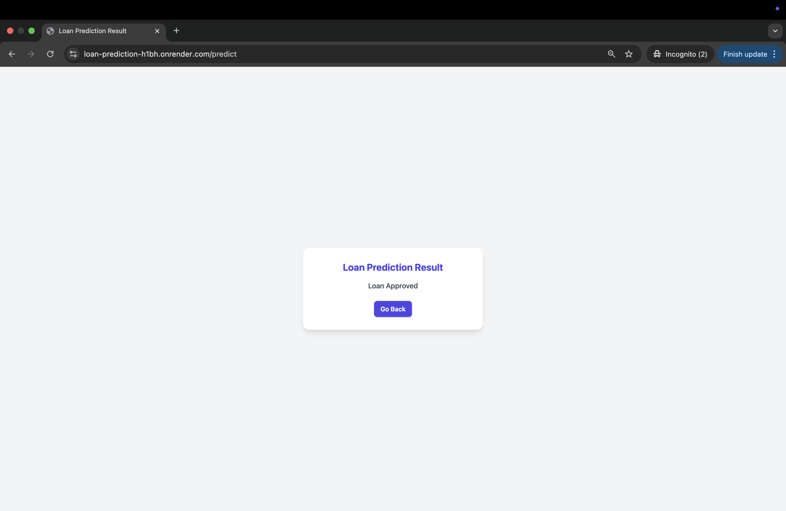

# Loan Prediction System

A machine learning web application that predicts whether a loan should be approved based on applicant details.  
This end-to-end solution includes data cleaning, feature engineering, model training (CatBoost), and deployment using Flask.

## Live Demo

[Link](https://loan-prediction-h1bh.onrender.com/) (hosted on Render)

---

## Dataset

This project uses the [Loan Prediction Dataset](https://www.kaggle.com/datasets/ninzaami/loan-predication) from Kaggle. It includes information such as applicant income, loan amount, credit history, and property area to determine loan eligibility.

---

## Features

- Cleaned and preprocessed loan application data
- Powerful **CatBoost classifier** trained on engineered features
- Web app interface built with **Flask**
- Deployed on **Render**
- Achieved strong performance with **AUC Score: 0.83** and **F1 Score: 0.84**

---

## Problem Statement

Financial institutions face challenges in identifying eligible loan applicants.  
This project solves that using supervised learning to classify loan approvals based on attributes like income, credit history, and more.

---

## ML Pipeline

1. **EDA & Preprocessing**

   - Handled missing values
   - Label encoding and one-hot encoding for categorical features
   - Feature engineering (e.g., `Log_Total_Income`, `EMI`, `Credit_Loan_Ratio`)

2. **Model Training**

   - Tried multiple models including Logistic Regression, Random Forest, XGBoost
   - Final model: **CatBoostClassifier** (chosen based on F1-score and AUC)

3. **Evaluation Metrics**
   - Accuracy
   - Precision, Recall, F1-Score
   - AUC-ROC Curve

---

## Tech Stack

| Component    | Technology          |
| ------------ | ------------------- |
| Frontend     | HTML, CSS, tailwing |
| Backend      | Flask               |
| ML Framework | CatBoost            |
| Deployment   | Render              |

## Web App (Flask)

The web app takes user inputs (loan applicant details) and predicts loan approval instantly.

### 🧾 Loan Application Form

### ✅ Prediction Result Page

## 
